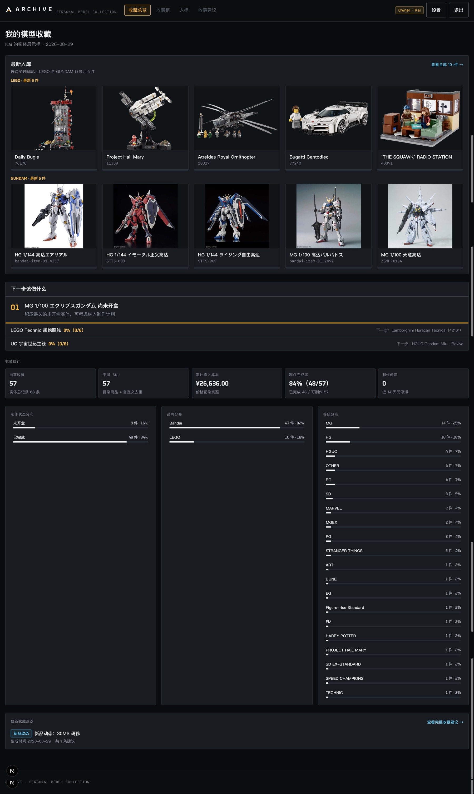
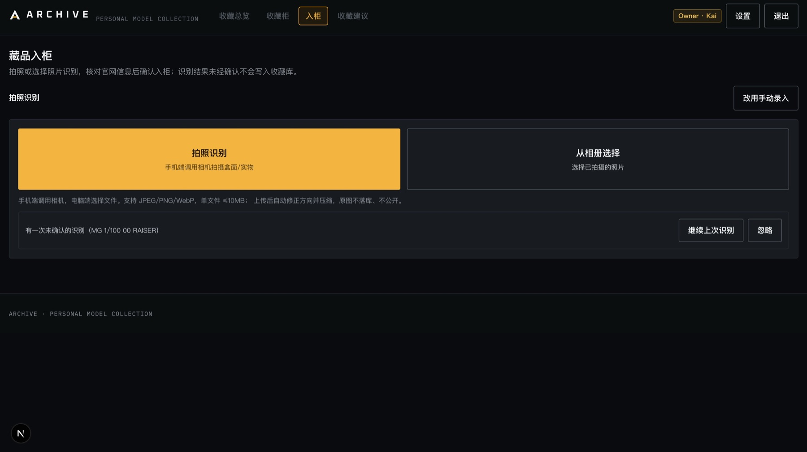
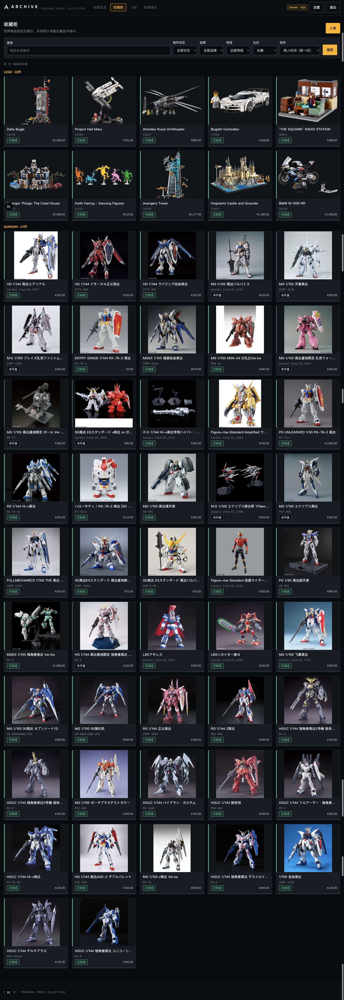
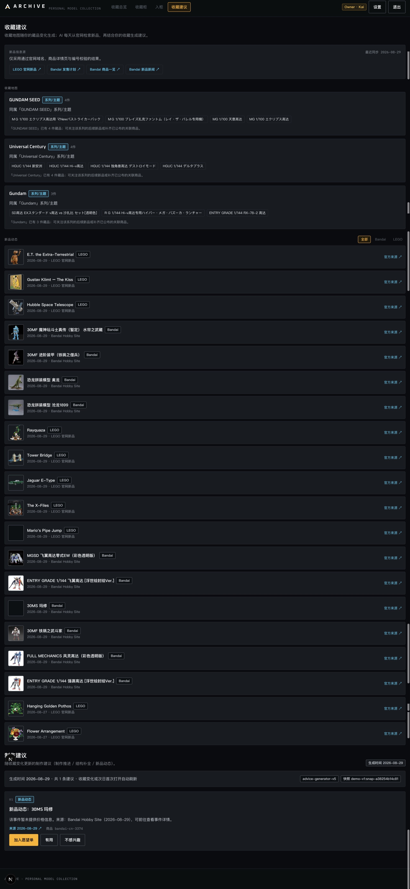

# ARCHIVE

> 一座会自己整理、持续理解你的个人模型收藏柜。

ARCHIVE 是面向 LEGO、Bandai 高达及其他模型收藏爱好者的 AI 收藏工作台。它把散落在相册、订单和记忆里的藏品，整理成一个可以浏览、维护和继续生长的个人档案。

你可以直接拍摄盒照或实物，先让 AI 提取商品信息，再核对官网名称和展示图后入柜。随着藏品增加，ARCHIVE 会从品牌、系列、等级与作品关系中形成“收藏地图”，结合近期新品信息给出有来源的收藏建议。

它不只是回答“我有什么”，也希望逐渐回答：我在收藏什么、这条收藏路线走到了哪里、下一件值得关注什么。

## 产品实机

点击任意图片可以查看完整尺寸。

<table>
  <tr>
    <td width="50%" valign="top">
      <a href="docs/images/archive-overview.jpg"></a><br>
      <sub><b>收藏总览</b> — 最近入库、收藏规模、完成度与品牌结构集中呈现。</sub>
    </td>
    <td width="50%" valign="top">
      <a href="docs/images/archive-intake.jpg"></a><br>
      <sub><b>拍照入柜</b> — 拍照或选择相册图片，识别结果必须经用户确认后才会入库。</sub>
    </td>
  </tr>
  <tr>
    <td width="50%" valign="top">
      <a href="docs/images/archive-collection.jpg"></a><br>
      <sub><b>收藏柜</b> — 用大图柜格浏览 LEGO 与高达藏品，并按状态、品牌和时间筛选。</sub>
    </td>
    <td width="50%" valign="top">
      <a href="docs/images/archive-advice.jpg"></a><br>
      <sub><b>收藏建议</b> — 从实际藏品形成收藏地图，同时汇集 LEGO 与 Bandai 的新品动态。</sub>
    </td>
  </tr>
</table>

## 从一张照片到一件藏品

ARCHIVE 的核心流程很简单：

> 拍照或上传图片 → AI 提取商品事实 → 搜索品牌官网 → 用户核对与修改 → 保存官网展示图并入柜

传统收藏工具通常要求手动填写名称、系列、比例、型号等字段。ARCHIVE 先用视觉模型理解照片，再根据识别到的编号和完整名称搜索官方商品页。AI 的判断不会直接写入收藏库，用户始终拥有最后确认权。

入柜后，一件藏品会同时保留两类信息：

- 商品档案：官方名称、品牌、主题或系列、等级、比例、型号、官网页面与展示图。
- 个人记录：购入时间、价格、收藏状态、制作进度、识别原图以及后来上传的藏品照片。

识别错误时可以直接修改字段并重新搜索，也可以切换到完全手动录入。系统不会为了“看起来聪明”而强行匹配一个不确定的目录结果。

## 四个主要体验

### 收藏总览

首页不是聊天框，而是一份每天打开就能看懂的收藏状态。LEGO 与 Bandai 分别展示按购买时间排列的最近 5 件藏品，并汇总当前数量、累计购入成本、制作完成率、品牌与等级分布。

“下一步该做什么”会优先提示尚未开盒、正在制作或值得继续维护的藏品，让收藏不只停留在买入记录。

### 收藏柜

藏品以 4–5 列大图卡片呈现，LEGO 在前、Bandai 在后，更接近浏览实体展示柜的感觉。商品图完整显示，不会为了填满卡片而裁掉模型主体；外围白边只在确有明显边框时进行轻量处理。

收藏柜支持关键词、制作状态、品牌、等级、是否在柜以及购入时间排序。进入详情页后，可以更新购买与制作信息，也可以在“藏品照片”中同时保留最初识别图和自己后来拍摄的照片。

### 入柜

桌面端可以从本地选择图片，手机浏览器在获得相机权限后可以直接调用后置摄像头。上传图片会先进行格式、大小与方向处理，然后交给视觉模型提取结构化商品信息。

系统优先搜索官网，展示候选商品的官方名称、来源链接和图片。只有用户确认候选并补充个人收藏信息后，藏品才会真正入库。

### 收藏建议

“收藏建议”不是固定模板，也不是只让模型润色几句文案。ARCHIVE 会组合：

- 当前用户实际拥有的品牌、主题、等级和作品分布；
- 从已有藏品动态形成的“收藏地图”；
- LEGO 与 Bandai 官方新品信息；
- 藏品的购入时间、制作状态和用户反馈。

在此基础上，建议模型负责整理值得关注的新品、尚未完成的收藏方向与下一步行动。新品不使用虚构的匹配分，建议保留来源和日期，最终判断仍由用户完成。

## ARCHIVE 是怎么做的

ARCHIVE 采用“AI 识别 + 官网事实 + 用户确认”的协作方式：

1. **AI 负责读图。** 视觉模型从盒照或实物照片中提取品牌、编号、等级、比例和候选名称。
2. **官网负责提供事实。** LEGO 优先使用 `lego.com/en-us` 商品资料；Bandai 只接受 Bandai Hobby、说明书站、P-Bandai 与白名单官方 CDN。
3. **用户负责最终判断。** 搜索结果先进入核对页，可以修改、重新搜索或手动录入，不会静默覆盖用户数据。
4. **本地数据库负责长期记忆。** 藏品、购买记录、照片和模型设置默认保存在当前电脑。
5. **建议模型负责组织信息。** 大模型结合收藏摘要、收藏地图和官网新品来源生成收藏建议。

产品界面使用 Next.js 与 React；本地数据通过 Prisma 和 SQLite 管理；Sharp 负责图片校验、方向修正与展示处理。模型接口保持 OpenAI 兼容，因此也可以在设置页替换为兼容服务。

## Owner 与 Visitor

ARCHIVE 提供两种彼此隔离的使用身份：

| 身份 | 适合场景 | 可以看到什么 | 权限 |
| --- | --- | --- | --- |
| Owner | 建立自己的长期收藏档案 | 当前电脑上的真实私人收藏 | 完整功能，包含模型设置 |
| Visitor | 快速了解和试用产品 | 独立沙箱中的 5 件 LEGO + 5 件 Bandai 样例 | 可浏览、入柜和生成建议，不能访问 Owner 设置与数据 |

首次初始化会自动创建 10 件脱敏 Visitor 样例。它们只包含公开商品事实、收藏状态、购买时间和示例价格，不包含 Owner 的照片、备注、API 配置、识别记录或完整数据库。

Visitor 新增和修改的数据也不会写入 Owner 收藏。为避免公共试用意外消耗过多额度，Visitor 默认每天最多进行 3 次图片识别和 1 次收藏建议生成。

## 在本地体验

### 环境要求

- Node.js `20.9.0` 或更高版本
- npm 10 或更高版本
- macOS、Linux 或 Windows

### 1. 下载并安装

```bash
git clone https://github.com/HouMonKy/ARCHIVE.git
cd ARCHIVE
npm ci
```

### 2. 创建自己的本地配置

macOS / Linux：

```bash
cp .env.example .env.local
```

Windows PowerShell：

```powershell
Copy-Item .env.example .env.local
```

打开 `.env.local`，为两个身份设置当前电脑自己的登录凭据：

```dotenv
OWNER_PASSWORD="<your-owner-password>"
VISITOR_ACCESS_CODE="<your-visitor-code>"
```

请替换尖括号中的占位值。仓库没有默认密码，也不会保存作者本人的凭据。

### 3. 初始化数据库与 Visitor 样例

```bash
npm run db:init
```

该命令会生成 Prisma Client、执行本地数据库迁移，并幂等创建 Owner、Visitor 与 10 件 Visitor 样例。重复执行不会删除已有藏品。

### 4. 下载样例商品图

```bash
npm run visitor:images
```

样例图会从 LEGO 与 Bandai 官方来源下载并校验，保存到当前电脑的 `private-assets/product-images/`。如果官网临时限流，可以联网后再次执行；没有下载成功时应用会显示占位图。

### 5. 启动 ARCHIVE

```bash
npm run dev
```

打开 [http://127.0.0.1:3000](http://127.0.0.1:3000)，使用第 2 步自行设置的 Owner 密码或 Visitor 访问码登录。

不配置任何 AI 服务也可以浏览 Visitor 样例、查看完整界面并手动入柜。真实图片识别和收藏建议需要继续完成下一节配置。

## 配置 AI

推荐在 `.env.local` 中填写：

```dotenv
# 图片识别
# 任意支持多模态的模型皆可
# 实测下来 DeepSeek 会好一点，在梁文谷时段价格优势特别明显 :)
MOONSHOT_API_KEY="<your-moonshot-key>"
KIMI_MODEL="kimi-k2.6"
KIMI_BASE_URL="https://api.moonshot.cn/v1"

# 收藏建议
DEEPSEEK_API_KEY="<your-deepseek-key>"
DEEPSEEK_MODEL="deepseek-v4-flash"
DEEPSEEK_BASE_URL="https://api.deepseek.com"
```

保存后重新启动 `npm run dev`。

Owner 也可以在右上角“设置”中填写模型、OpenAI 兼容 API 地址和 Key。界面配置优先于环境变量；API Key 会使用 AES-256-GCM 加密后写入本地数据库，读取接口不会回显原始 Key。Visitor 无权访问设置页。

上传识别时，处理后的图片会发送给配置的视觉模型服务；生成收藏建议时，结构化收藏摘要会发送给建议模型。请只使用你信任的服务，并遵守相应服务条款。

## 数据留在哪里

ARCHIVE 默认是一个本地优先的个人工具。克隆公开仓库不会获得作者的 Owner 收藏或 API 配置。

| 本地路径 | 保存内容 | 是否提交到 Git |
| --- | --- | --- |
| `prisma/app.db` | 当前电脑的 Owner／Visitor 数据与设置密文 | 否 |
| `private-assets/product-images/` | 官网商品图缓存 | 否 |
| `private-assets/user-covers/` | 入柜识别图 | 否 |
| `private-assets/asset-photos/` | 用户追加的藏品照片 | 否 |
| `private-assets/secrets/` | API 配置加密主密钥 | 否 |
| `.env.local` | 登录凭据、API Key 与本地设置 | 否 |
| `.env.example` | 不含密钥的配置模板 | 是 |
| `src/lib/visitor-dataset.ts` | 10 件脱敏 Visitor 样例商品事实 | 是 |

README 中的图片是产品界面截图；仓库不提供可复用的 LEGO／Bandai 官网原始商品图缓存。实际运行时下载的官网图和用户照片只保存在使用者自己的 Git 忽略目录中。

## 常用命令

| 命令 | 用途 |
| --- | --- |
| `npm run dev` | 启动本地开发服务器 |
| `npm run build` | 创建生产构建 |
| `npm run start` | 启动已构建的本地生产服务 |
| `npm run db:init` | 非破坏迁移并补齐基础数据与 Visitor 样例 |
| `npm run visitor:seed` | 幂等补齐 10 件 Visitor 样例 |
| `npm run visitor:images` | 下载并校验 Visitor 样例的官网展示图 |
| `npm run lint` | 检查代码规范 |
| `npm run typecheck` | 执行 TypeScript 类型检查 |
| `npm run test:product` | 执行产品级单元与契约测试 |
| `npm run test:product:e2e` | 执行 Playwright 产品流程测试 |
| `npm run secret:scan` | 扫描 Git 可见文件与本地数据库中的密钥泄漏 |

## 常见问题

<details>
<summary><b>入柜页为什么没有 AI 拍照入口？</b></summary>

生产模式没有有效识别 Key 时，页面只保留手动录入。检查 `MOONSHOT_API_KEY`，保存后重新启动开发服务器。

</details>

<details>
<summary><b>Visitor 有样例藏品，但没有商品图？</b></summary>

运行 `npm run visitor:images`。官网偶尔会限流、跳转或暂时不可访问，联网后重试即可。

</details>

<details>
<summary><b>手机点击拍照时没有打开相机？</b></summary>

确认浏览器已获得相机权限。`localhost` 通常可作为安全上下文；从手机访问电脑的局域网地址时，部分浏览器会要求 HTTPS。也可以使用“从相册选择”完成相同流程。

</details>

<details>
<summary><b>3000 端口被占用？</b></summary>

```bash
PORT=3001 npm run dev
```

然后访问 `http://127.0.0.1:3001`。

</details>

<details>
<summary><b>终端偶尔出现 “The destination stream closed early” 代表数据损坏吗？</b></summary>

不是。这是 Next.js 16.3.x 在浏览器刷新、跳转或关闭页面导致 RSC 响应提前结束时可能输出的框架日志。页面和数据正常时可以忽略，并在 Next.js 稳定版包含上游修复后升级。

</details>

## 托管说明

ARCHIVE 的完整体验优先面向本地运行。若要托管，需要配置远程数据库、固定的 `SESSION_SECRET`、可靠的访问凭据，以及用于官网缓存图和用户照片的私有对象存储。临时文件系统无法提供与本地模式相同的图片持久化体验。

无论本地还是托管，都不要上传 `.env.local`、数据库、`private-assets/` 或任何真实 API Key。

## 图片与来源

商品事实与图片来源链接会保留在藏品记录中，便于追溯。LEGO 与 Bandai 的名称及图像权利归各自权利人所有；ARCHIVE 与这些品牌没有隶属或背书关系。请在自己的使用场景中遵守相关网站条款与权利要求。
