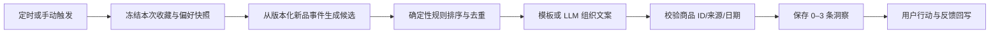

# Model Base 产品需求文档（PRD）

> 版本：0.1｜阶段：V1 Demo / MVP Beta 规划｜日期：2026-08-25｜状态：可进入原型开发

## 0. 产品决策摘要

| 议题 | 本版结论 |
| --- | --- |
| 产品形态 | Dashboard-first 的个人收藏 Agent，不以聊天框作为主入口 |
| 首发用户 | 已收藏 20–300 件、持续购买或制作的中文高达模型玩家 |
| 首发品类 | Bandai 高达拼装模型，优先 HG/RG/MG/PG/MGEX；其他品类只支持手动记录 |
| 首发平台 | 响应式 Web；桌面端看 Dashboard，移动端优先完成拍照上传 |
| 核心闭环 | 建档 → 看懂收藏 → 获得建议 → 采取行动/反馈 → 更新偏好 |
| AI 边界 | AI 只提交带置信度的草稿；收藏入库、偏好变更均由用户确认 |
| 价值口径 | V1 展示“累计购入成本”，不冒充实时市场价值，不做升值预测 |
| 图片边界 | D0 可使用 Bandai 官网真实商品图，但仅限本人本机私用，不商用、不公开部署、不传播 |
| V1 Demo | 单演示用户、本地数据库、版本化样例目录、Bandai 真实商品图、可见的演示 AI 模式、手动触发周报 |
| MVP Beta | 加入真实账号隔离、云对象存储、真实多模态模型、定时任务、导出与删除 |

优先级：**数据正确和可追溯 > 主闭环完整 > 自动化程度 > 品类覆盖面**。

## 1. 背景与机会

模型收藏不是一张商品清单，而是由“商品身份、实体状态、制作进度、收藏路线、预算和长期偏好”组成的个人资产体系。现有记录工具能回答“我有什么”，但很难回答：

- 我当前的收藏结构是什么；
- 哪些模型积压最久、下一步应该做什么；
- 一个新品是否与我的路线、等级和预算匹配；
- AI 为什么作出这项建议，以及它依据的数据是否可信。

Model Base 将收藏台账作为事实层，将可编辑的用户偏好作为记忆层，将主动生成且可反馈的洞察作为 Agent 层，最终形成一个会随使用逐渐改善的私人收藏顾问。

## 2. 产品目标与非目标

### 2.1 V1 要验证的三项假设

1. **建档效率**：单张清晰盒面图能让用户在 30 秒中位时间内确认一件藏品，比完整手填更省力。
2. **结构价值**：Dashboard 能在一次访问中讲清数量、成本、品牌/等级分布和制作积压。
3. **建议价值**：每周不超过 3 条、带依据和操作入口的洞察，能推动状态更新、加入愿望单或明确反馈。

### 2.2 北极星指标

**周有效收藏行动用户数**：一周内至少完成一次“确认入库、更新状态、采纳建议或明确反馈”的用户数。仅打开页面或阅读周报不计入。

### 2.3 明确不做

- 不做交易、代购、自动下单、社区、关注、排行或公开收藏柜；
- 不做真伪鉴定、投资建议、升值预测、稀有度星级；
- 不以单个在售价格或单笔成交价代表“市场价值”；
- 不做房间/收藏柜照片中的多物体批量识别；
- 不在 V1 承诺全品牌、全系列商品识别；
- 不由大模型凭空生成收藏知识图谱或“系列完整度”；
- 不开发原生 iOS/Android 客户端。

## 3. 用户与核心任务

### 3.1 核心用户

“路线型模型玩家”：有 20 件以上藏品，购买记录分散在相册、电商订单和备忘录中；既关心收藏路线，也面临未开盒和制作中积压。专业倒卖者和纯投资用户不是 V1 服务对象。

### 3.2 用户任务（JTBD）

- 当我拿到一个新模型时，我想用一张盒面图快速建档，同时保留修正权。
- 当我打开产品时，我想立刻知道收藏规模、累计成本、结构与积压，不必先问 AI。
- 当我考虑新品时，我想知道是否重复、是否符合偏好、补齐了什么结构。
- 当某件模型长期停在制作中时，我想收到低打扰、可立即执行的提醒。
- 当 AI 推断我的偏好时，我想看到依据，并能修改、关闭或删除这段记忆。

## 4. 产品原则

1. **Dashboard 优先**：聊天可以是未来的解释入口，但不是信息架构中心。
2. **事实与推断分层**：用户确认的数据、目录事实、AI 推断分别存储和展示。
3. **确认后写入**：识别结果永不静默入库；低置信度时宁可“不知道”。
4. **每条建议有证据**：展示匹配分、理由、来源日期和可执行操作。
5. **允许 AI 失败**：识别或生成服务失败时，手动新增和收藏管理仍可完成。
6. **少而有用**：一份周报最多 3 条洞察；没有可靠信息就明确说本周无建议。

## 5. 范围与版本

### 5.1 V1 Demo（本开发任务目标）

- 单个演示用户 Kai，无正式账号系统；
- 手动新增、查看、编辑、归档收藏实体；
- 上传单张盒面图，获得候选并确认入库；
- 重复 SKU 提醒，同时允许收藏同款多件；
- Dashboard 核心统计和下钻；
- 基于样例新品事件与确定性规则生成站内周报；
- 对洞察执行“加入愿望单、更新状态、有用、不感兴趣”；
- 预置 Kai 的显式品类、等级、系列与预算偏好，作为推荐依据；
- 12 个目录商品使用 Bandai 官网真实商品图，仅缓存于已忽略的本机目录，并保留原始页面 URL；
- 本地 Fixture AI（固定演示数据）与真实 AI Provider 接口分离，演示模式必须显著标识。

### 5.2 MVP Beta（私测必须补齐）

- 注册、登录、租户隔离、注销；
- 真实多模态识别、私有对象存储、限流与调用审计；
- 可编辑 onboarding 与“我的偏好”；
- 商品目录/新品事件后台导入；
- 定时周报、失败重试、时区处理；
- 数据导出、单图删除、记忆清空、账户级联删除；
- 产品埋点、错误监控与隐私说明。

### 5.3 P1 / V2

- P1：订单截图脱敏后 OCR、CSV 批量导入、制作日志、邮件/Push 订阅、更多品牌；
- V2：版本化系列路线、关系图、用户选择路线后的完整度与补齐规划。

## 6. 信息架构

| 页面 | 核心问题 | 主要动作 |
| --- | --- | --- |
| Dashboard | 我现在的收藏状态如何？ | 查看统计、进入待办、浏览最新洞察 |
| 收藏库 | 我拥有哪些实体？ | 搜索、筛选、排序、新增 |
| 收藏详情 | 这一件模型的事实和进度是什么？ | 编辑状态、价格、日期、进度、备注 |
| AI 添加 | 这张图片对应哪个商品？ | 上传、选候选、修正、确认 |
| 周报/洞察 | Agent 本周建议我做什么？ | 采纳、更新、反馈、忽略 |
| 偏好设置 | AI 如何理解我？ | 编辑显式偏好、查看/删除 AI 推断 |

V1 Demo 至少提供 `/`、`/collection`、`/collection/:id`、`/add`、`/reports/latest` 五个可导航页面。

## 7. 状态与统计口径

`CollectionAsset` 只代表用户实际取得的一件物理实体，同一 SKU 的两盒模型是两条记录；愿望和预订另存为 `UserProductIntent`，商品目录身份也与两者分开。

- 意向状态：`WISHLIST`、`PREORDERED`，不计入收藏资产统计；
- 实体去向：`ACTIVE`、`SOLD`、`GIFTED`、`RETURNED`；归档统一使用独立的 `archived_at`，不再混入状态枚举；
- 制作状态：`UNOPENED`、`OPENED`、`BUILDING`、`COMPLETED`、`NOT_APPLICABLE`；
- `BUILDING` 的进度为 1–99%；切换为 `COMPLETED` 时建议写入 100% 和完成日期；
- 收藏数量：去向为 `ACTIVE` 且 `archived_at` 为空的实体数；
- 不同 SKU：上述实体中去重后的 `catalog_product_id` 数量，自定义商品按规范化名称去重；
- 累计购入成本：上述实体中已填写购买价的金额之和，并同时显示缺价件数；
- 完成率：`COMPLETED / (UNOPENED + OPENED + BUILDING + COMPLETED)`，只计算 ACTIVE、未归档且可制作的实体；
- 制作停滞：处于 `BUILDING` 且连续 14 天没有状态、进度或日志变化。

## 8. 功能需求与验收

| ID | 级别 | 需求 | 可验收结果 |
| --- | --- | --- | --- |
| FR-01 | P0 | 收藏 CRUD | 可手动新增、查看、编辑、归档；失败后保留已填内容 |
| FR-02 | P0 | AI 单图建档 | 支持 JPEG/PNG/WebP、单文件 ≤10MB；结果未经确认不写收藏库 |
| FR-03 | P0 | 候选与置信度 | 展示最多 3 个候选和字段级不确定项；低置信度进入手动兜底 |
| FR-04 | P0 | 重复处理 | 同 SKU 已存在时显示数量；用户可取消或新增第二件实体 |
| FR-05 | P0 | 状态进度 | 状态变更遵守第 7 节口径，Dashboard 随保存结果更新 |
| FR-06 | P0 | Dashboard | 展示实体数、SKU 数、品牌/等级分布、状态、完成率、成本与缺价数，均可下钻 |
| FR-07 | P0 | 周报资格 | 少于 3 件已确认藏品时不生成个性化建议，解释如何解锁 |
| FR-08 | P0 | 洞察卡 | 每期 0–3 条；每条含类型、结论、分数、理由、来源日期和动作 |
| FR-09 | P0 | 反馈抑制 | “不感兴趣”的同一推荐 30 天内不再出现，除非依据发生实质变化 |
| FR-10 | P0 | 空与错 | 空收藏、目录缺失、图片模糊、服务超时、无新品均有明确状态和手动出口 |
| FR-11 | Beta | 偏好记忆 | 显式偏好与 AI 推断分开，推断有依据、更新时间并可删除 |
| FR-12 | Beta | 隐私权利 | 支持数据导出、图片删除、记忆清空和账户级联删除 |

### 8.1 AI 添加主流程

1. 上传前校验文件类型、体积，并提醒“一张图只放一个盒面”；
2. 创建识别任务，界面展示进行中、超时与重试状态；
3. Provider 输出结构化视觉线索和候选，不直接创建收藏；
4. 系统以版本化目录补全名称、品牌、等级、发售年等事实；
5. 用户选择候选或手动修正，填写拥有/制作状态，价格和日期选填；
6. 根据 `catalog_product_id` 检查重复；
7. 用户最终确认后创建实体、刷新统计并记录识别是否被修正。

置信度是待校准的产品阈值：`≥0.90` 可预选但仍需确认；`0.60–0.89` 展示至多 3 个候选并高亮不确定字段；`<0.60` 不预选，转手动搜索/录入。

必须覆盖：图片模糊/反光/损坏、多商品入镜、限定版与再版相似、目录无结果、识别超时、重复提交。任何失败都不能阻止手动入库。

### 8.2 Dashboard

首屏顺序：问候与时间 → 5 个核心统计 → 状态/品牌/等级分布 → 1–3 个下一步事项 → 最新周报。图表点击后必须进入带相同过滤条件的收藏列表，不能成为不可操作的装饰。

空收藏时用“上传盒面图”和“手动新增”两个入口替代空图表；有收藏但价格缺失时，金额旁显示缺价件数，不把缺失值当 0 元。

### 8.3 周报与主动 Agent

候选排序默认权重：品类/等级/系列偏好 40%，收藏互补性 25%，用户显式预算 15%，新品时效 10%，历史反馈 10%；已拥有同 SKU 为强负向项。权重属于可版本化配置，LLM 只负责解释，不决定事实或候选集合。

每条洞察至少存储 `type`、`score`、`reason_codes`、关联商品/实体 ID、`source_url`、`source_date`、`generator_version`。预算只能来自用户显式填写，不能从零散购买记录推断消费能力。

## 9. Agent 与技术架构

Agent 不是一个拥有任意工具权限的聊天循环，而是一条可审计的任务管道：

- **Memory（记忆）**：已确认收藏、显式偏好、带依据的 AI 推断、历史反馈；
- **Tools（工具）**：版本化商品目录、新品事件、用户收藏查询；价格与社区数据在完成授权评审后才可加入；
- **Reasoning（推理）**：SQL/程序计算事实，规则生成候选并打分，语言模型只把已验证事实组织成解释；
- **Scheduler（调度）**：按用户时区创建幂等任务，失败可重试，同一用户同一周期只发布一份报告；
- **Guardrail（护栏）**：Agent 无权直接购买、修改用户收藏或写入显式偏好，所有此类动作都需用户确认。

D0 推荐使用 Next.js App Router、TypeScript strict、Tailwind CSS、Prisma/SQLite、Vitest 和 Playwright，保证无外部账号也能复现。Beta 再迁移至 Postgres、账号服务、私有对象存储、持久队列与 Cron；AI、目录和新品源都通过 Provider 接口隔离。首版不引入 LangChain、向量库、Redis、独立 Python 服务或图数据库。

V2 的知识关系先以可追溯的关系表表达：`product_relations(from_product_id, relation_type, to_product_id, source_id, review_status)` 与 `route_memberships(route_id, product_id, sequence_no)`。只有多跳查询规模和延迟经过实测证明关系数据库无法满足时，才评估图数据库。

## 10. 数据模型

| 实体 | 关键字段 | 说明 |
| --- | --- | --- |
| User | id, locale, timezone | Demo 固定 Kai；Beta 替换为真实账号 |
| UserPreference | user_id, kind, value, source, evidence, updated_at | `source` 区分 USER 与 AI_INFERRED |
| CatalogProduct | id, brand, line, grade, canonical_name, release_year, source, catalog_version | 版本化商品事实 |
| CollectionAsset | id, user_id, catalog_product_id?, custom_name?, disposition_state, archived_at?, build_state, progress, purchase_price_minor?, currency?, dates, note, confirmed_at | 一件已取得的物理实体；手动保存或识别确认后才有 `confirmed_at` |
| UserProductIntent | id, user_id, catalog_product_id, state, expected_price_minor?, created_at | 愿望或预订，不计入实体数、成本和完成率 |
| RecognitionJob | id, user_id, state, provider, provider_version, result_json, error_code, confirmed_at | 识别追溯与失败恢复 |
| ReleaseEvent | id, catalog_product_id, title, announced_at, source_url, dataset_version | 周报候选来源 |
| InsightReport | id, user_id, period_start/end, snapshot_version, generator_version, status | 一期周报 |
| Insight | id, report_id, type, score, reason_codes, product_id?, asset_id?, source_url/date | 可验证洞察 |
| InsightFeedback | insight_id, user_id, value, acted_at | 有用/无用/采取行动 |
| AgentRun | id, run_type, input_version, output_refs, status, latency, error | Agent 运行审计 |

金额一律用最小货币单位整数保存；日期与价格可为空；所有 Beta 用户数据表必须带 `user_id` 并通过服务端作用域隔离。

## 11. AI 真实性、安全与隐私

- AI 输出使用固定 JSON Schema 校验；引用的商品、收藏和来源必须真实存在；
- OCR/图片文字视为不可信输入，不得将其中指令作为 Agent 指令执行；
- 无可靠目录事实时显示“暂未识别”，不得补写发售年、价格或版本；
- 保存 provider/model、提示词版本、目录版本、输入摘要和输出，支持复现；
- Demo Fixture 必须显示“演示识别”，不能伪装成真实模型调用；
- Bandai 官网商品图只用于本人本机的 D0：每张记录来源页面、原图 URL、抓取日期和 `rights_basis=personal-use`；二进制文件不得进入 Git、构建产物、备份包或公开链接；
- Beta 上传时移除 EXIF；原始识别图默认 24 小时内删除，保留作封面需明确同意并保存处理后副本；
- 订单截图可能包含姓名、电话、地址和订单号，未实现自动遮罩与专项测试前不得上线；
- 默认不以用户数据训练通用模型；第三方模型及数据保留策略必须披露；
- 推荐统一提示“收藏适配建议，不构成价格或投资判断”。

## 12. 非功能要求

- 性能目标（Beta）：Dashboard 数据接口 P95 ≤2 秒；识别服务 P95 ≤20 秒；周报任务 P95 ≤60 秒；
- 可靠性：识别失败可重试且不重复入库；周报任务幂等；无洞察是合法成功状态；
- 安全：服务端鉴权、私有文件、短期签名 URL、上传 MIME/文件头双校验、速率限制；
- 可访问性：键盘可完成主要流程，表单有可见标签和错误说明，颜色不是唯一状态信号；
- 响应式：360px 宽度可上传、确认和编辑；桌面 1280px 可完整浏览 Dashboard；
- 本地性：开发与运行脚本默认只绑定 `127.0.0.1`；D0 禁止部署到公网、局域网共享或生成可传播的静态站点；
- 可观测性：记录成功率、延迟、错误码和版本，不记录不必要的原图与敏感文本。

## 13. 指标与埋点

核心漏斗：`注册 → 开始上传 → 获得结果 → 确认保存 → 查看 Dashboard → 查看周报 → 对洞察行动`。

事件至少包括：`asset_upload_started`、`recognition_completed`、`recognition_failed`、`asset_confirmed`、`asset_corrected`、`duplicate_warning_shown`、`dashboard_viewed`、`report_generated`、`insight_viewed`、`insight_feedback`、`recommendation_saved`、`collection_status_updated`。

50 名种子用户的首轮目标（属于待验证假设，不能当成 Demo 自动化验收）：

- 上传到确认保存转化率 ≥65%，确认时间中位数 ≤30 秒；
- 目录内清晰盒面图精确 SKU Top-1 ≥85%、Top-3 ≥95%；
- 识别成功率 ≥97%，AI 结果无需修改即可确认比例 ≥70%；
- 首周留存 ≥30%，四周留存 ≥20%；
- 周报“有用”率 ≥35%，洞察行动率 ≥15%，生成成功率 ≥99%；
- 人工抽检的无来源事实或错误引用率 <1%。

## 14. Demo 验收场景

- **D-01** 清晰的受支持盒面图返回候选；未点击确认前收藏数量不变，确认后数量增加 1。
- **D-02** 低置信度或目录外图片不自动猜，保留上传状态并允许手动新增。
- **D-03** 已有同 SKU 时明确显示重复数量；确认后可新增第二件实体。
- **D-04** 将实体从未开盒改为制作中并填写进度后，详情与 Dashboard 同步更新。
- **D-05** Dashboard 对 8 条固定种子数据算出确定的数量、成本、缺价数和完成率，图表可下钻。
- **D-06** 少于 3 件确认收藏时周报不生成个性化建议；达到门槛后生成不超过 3 条。
- **D-07** 洞察所引用的商品/实体/来源均存在；“不感兴趣”后 30 天内不重复推荐。
- **D-08** 没有 AI 密钥时产品仍可用，并显著显示 Fixture 演示模式；识别失败时手动新增仍成功。
- **D-09** 空收藏、无新品、超时、损坏文件和 10MB 以上文件均有可恢复的明确反馈。
- **D-10** 所有页面在 360px 与 1280px 下无横向溢出，键盘可完成新增和确认流程。

## 15. 发布计划与门槛

### D0：可演示闭环

完成第 14 节场景，以 12 个目录商品、8 件 Kai 收藏、Kai 的固定显式偏好和 4 条新品事件构建可复现演示。D0 不声称识别准确率或市场数据实时性。

### Beta：50 人、4 周私测

开放前必须完成账号隔离、对象存储权限、EXIF 清理、账户删除，并以独立盲测集验证至少 500 张图片；首发目录覆盖种子用户实际藏品至少 80%；人工抽检至少 100 份周报，无虚构商品、错误引用和无依据市场价值结论。

### V2：知识图谱

只有在存在版本化路线成员清单、用户主动选择路线范围，并能解释“分子/分母”后才展示完整度。路线变化必须保留版本，避免历史报告漂移。

## 16. 主要风险与应对

| 风险 | 后果 | 当前应对 |
| --- | --- | --- |
| 相似版本识别错误 | 错 SKU 污染画像与建议 | 最多 3 候选、字段置信度、强制确认、目录事实校验 |
| 跨品类目录失控 | 识别和图谱均不可信 | 首发只承诺高达，数据模型保留扩展字段 |
| 把在售价当资产价值 | 误导购买或投资判断 | V1 只显示累计购入成本，价格能力单独立项 |
| 周报幻觉 | 信任崩塌 | 候选规则化、LLM 只写解释、引用 ID/来源校验 |
| 建档冷启动太重 | 用户未看到价值就流失 | 3 件即激活周报；手动录入永远可用 |
| 图片与订单隐私 | 泄露 PII | V1 不做订单截图；Beta 脱敏、短存储、可删除 |
| 私用图片意外外流 | 超出当前私人使用边界 | 官网图不进 Git/构建包，服务仅监听本机，保留来源清单 |
| 数据源许可或接口变化 | 新品/价格中断 | 版本化导入、来源与日期展示、无数据时降级 |

## 17. 外部数据可行性备注

2026-08-25，产品负责人已确认 D0 仅本人本机使用，不商用、不公开、不传播。Bandai 官方条款禁止超出私人使用范围的复制、展示和发布；本项目据此只允许一次性下载 12 张官网商品图到本机私有缓存，不做页面爬虫、批量镜像、热链或再分发，并为每张图片保存来源页面。若未来进入演示、协作、托管或商业使用，官网图必须立即替换为占位图，或另行取得书面许可。

BrickLink 官方 API 提供 LEGO 目录和近 6 个月价格指南，但需要账号密钥且访问位置受注册限制；eBay Browse API 提供当前在售搜索并要求应用令牌，而历史 Marketplace Insights 能力并非对新用户开放。这些能力都不能直接证明高达模型的可靠“市场价值”。因此 D0 使用带版本的样例目录和新品事件，Beta 在完成授权、许可、地域、币种和新鲜度评估后再接入数据源。

参考：[Bandai 网站使用条件](https://www.bandai.co.jp/cn/site/notice/)、[Bandai 图片使用说明](https://www.bandai.co.jp/support/top/faqs/detail/426)、[BrickLink API](https://www.bricklink.com/v3/api.page)、[BrickLink Price Guide](https://www.bricklink.com/v3/api.page?page=get-price-guide)、[eBay Browse API](https://developer.ebay.com/api-docs/buy/api-browse.html)、[eBay Buy API Filters](https://developer.ebay.com/api-docs/buy/static/ref-buy-browse-filters.html)。

## 18. 待产品负责人确认（当前均按默认推进）

- 首发是否坚持只承诺高达识别；默认“是”，否则目录与盲测成本显著扩大；
- D0 是否接受显著标识的 Fixture AI；默认“是”，否则必须先提供真实模型密钥与预算；
- Beta 是否需要实时市场价格；默认“否”，需单独完成数据许可和估值口径评审；
- Beta 是否面向中国大陆公开运营；默认“先做小范围邀请制私测”，上线前另做合规评审。Bandai 官网图不得随 Beta 进入任何共享环境。

## 19. D0 冻结 Fixture 与预期结果

以下全部是 `dataset_version=demo-v1` 的合成演示记录，不代表新品、在售或市场价格。统一使用 `Asia/Shanghai`、报告日期 `2026-08-25`、币种 CNY。

目录固定 12 条：P01 `MG RX-78-2 Gundam Ver.3.0`（MG/UC）、P02 `MG Zeta Gundam Ver.Ka`（MG/UC）、P03 `MGEX Unicorn Gundam Ver.Ka`（MGEX/UC）、P04 `RG ν Gundam`（RG/UC）、P05 `PG Unleashed RX-78-2 Gundam`（PG/UC）、P06 `HGUC Narrative Gundam C-Packs`（HG/UC）、P07 `MG Sinanju Stein Narrative Ver. Ver.Ka`（MG/UC）、P08 `RG Sazabi`（RG/UC）、P09 `HGUC Gundam Mk-II Revive`（HG/UC）、P10 `MG Hyaku-Shiki Ver.2.0`（MG/UC）、P11 `MG Wing Gundam Zero EW Ver.Ka`（MG/AC）、P12 `MG Freedom Gundam Ver.2.0`（MG/CE）。品牌均为 Bandai，品类均为 Gundam；每条增加 `image_source_page`、`image_source_url`、`image_fetched_at`、`rights_basis=personal-use`，图片二进制仅存在本机私有缓存。

Kai 的实体固定如下，价格单位为分，均已确认且 `archived_at=null`：

| 实体 | 商品 | 去向/制作 | 进度 | 购入价 | 最后更新 |
| --- | --- | --- | ---: | ---: | --- |
| A01 | P01 | ACTIVE/COMPLETED | 100 | 45000 | 2026-08-10 |
| A02 | P03 | ACTIVE/BUILDING | 65 | 120000 | 2026-08-01 |
| A03 | P04 | ACTIVE/UNOPENED | 0 | 32000 | 2026-08-12 |
| A04 | P08 | ACTIVE/OPENED | 0 | 35000 | 2026-08-14 |
| A05 | P09 | ACTIVE/COMPLETED | 100 | null | 2026-08-16 |
| A06 | P10 | ACTIVE/UNOPENED | 0 | 50000 | 2026-08-18 |
| A07 | P11 | SOLD/COMPLETED | 100 | 48000 | 2026-08-19 |
| A08 | 自定义 `Technic Supercar Demo`，品牌 LEGO | ACTIVE/NOT_APPLICABLE | 0 | 90000 | 2026-08-20 |

另有意向 I01=P11/WISHLIST。显式偏好固定为品类 Gundam、等级 MG、路线 UC、月预算 200000 分。Dashboard 初始预期：实体总记录 8、当前收藏 7、不同 SKU 7、累计成本 372000 分、缺价 1、可制作实体 6、完成 2、完成率显示 33%、品牌分布 Bandai 6/7 与 LEGO 1/7；A02 命中 14 天制作停滞。

新品事件固定为 E01=P02/70000/2026-08-20、E02=P06/28000/2026-08-18、E03=P12/55000/2026-08-15、E04=P03/130000/2026-08-22；来源统一为 `Model Base Demo Feed` 和本地 `/demo/sources/{eventId}`，并显示“演示数据”。发布推荐分数不重归一化：偏好 40 分（品类 15+等级 15+路线 10）、互补 25 分（同路线 ACTIVE 商品至少 2 件且候选未拥有）、预算 15 分（事件价不高于显式月预算）、30 日内时效 10 分、近 90 日同等级正反馈且无负反馈 10 分；字段缺失记 0。已拥有商品和 30 日内被点“不感兴趣”的商品直接排除。初始排序必须是 P02=90、P06=75、P12=55，P03 因已拥有而排除；首份周报还包含 A02 停滞提醒和“完成率 33%”结构洞察，每类最多一条。

识别样例固定为：`box-unicorn-demo.svg` 返回 P03=0.96 并可预选；`box-zeta-glare-demo.svg` 返回 P02=0.74、P09=0.66、P10=0.61，三项均需用户主动选择；`box-unknown-demo.svg` 无 `≥0.60` 候选并直接提供手动录入。确认前任何样例都不得创建实体；确认请求以 idempotency key 去重。
